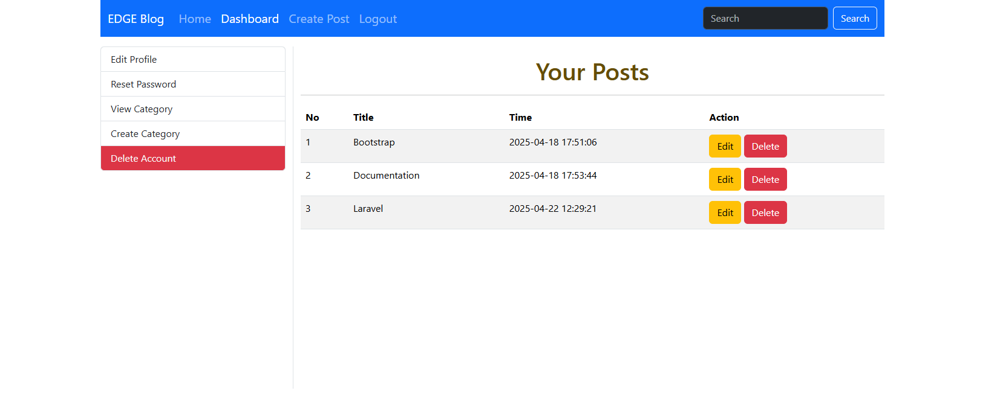
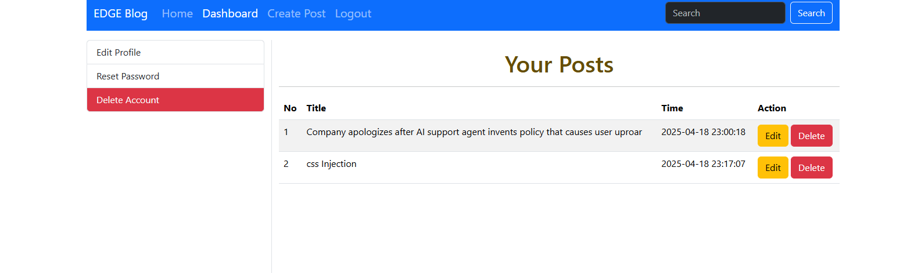
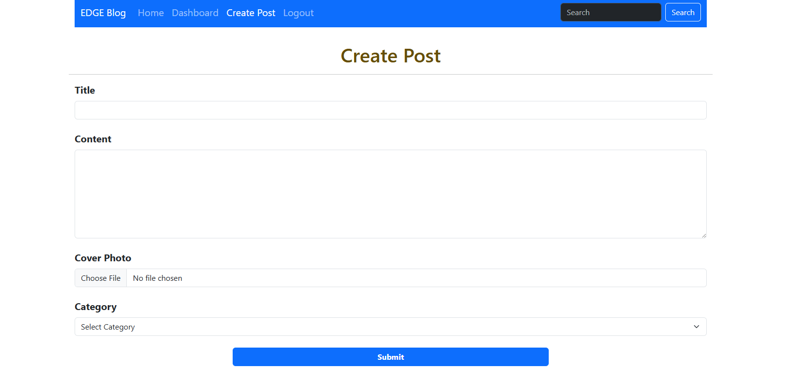

# EDGE Blog

**EDGE Blog** is a PHP-based blogging platform designed to allow users to register, log in, and manage posts and categories in a personalized blogging environment. The project includes essential blogging features such as post creation, editing, deletion, user account management, and a categorized content structure.

## 🚀 Features

- **User Registration & Authentication**
- **User Dashboard**
- **Post Creation, Editing, and Deletion**
- **Category Management**
- **Password Reset and Profile Editing**
- **Search Functionality**
- **Custom Feed Generation**
- **Modular Includes (Header/Footer)**

## 🛠️ Technologies Used

- **PHP** – Backend scripting
- **MySQL** – Database management
- **HTML/CSS** – Frontend layout and styling
- **JavaScript** – Interactivity (assumed from project structure)

## 📁 Project Structure

```
EDGE Blog/
├── images/                    # Directory for uploaded or used images
├── includes/
│   ├── header.php             # Reusable header component
│   └── footer.php             # Reusable footer component
├── connect.php                # Database connection script
├── customFeed.php             # Custom feed generator
├── index.php                  # Home page
├── login.php                  # Login page
├── registration.php           # Registration form
├── registrationSubmit.php     # Backend for registration
├── search-result.php          # Search functionality
├── user/
│   ├── createCategory.php
│   ├── createPost.php
│   ├── dashboard.php
│   ├── delete-account.php
│   ├── delete-category.php
│   ├── delete-post.php
│   ├── edit-category.php
│   ├── edit-post.php
│   ├── edit-profile.php
│   ├── header.php             # User-specific header
│   ├── logout.php
│   ├── reset-password.php
│   └── view-category.php
```

## ⚙️ Setup Instructions

1. Clone or download the repository.
2. Place it in your server directory (e.g., `htdocs` if using XAMPP).
3. Import the database.
4. Update the `connect.php` file with your database credentials.
5. Start your local server and navigate to the project in your browser.

## 🖼️ Screenshots

### Homepage


### Admin Dashboard



### User Dashboard



### Create Post



## 📌 Notes

- Ensure you have PHP and MySQL set up (like XAMPP, LAMP, WAMP).
- Check file permissions if images or uploads do not work.

## 📜 License

This project is open-source and free to use for learning purposes.
